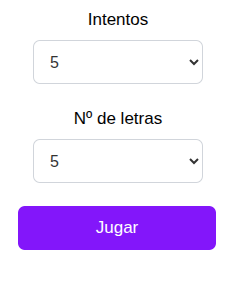
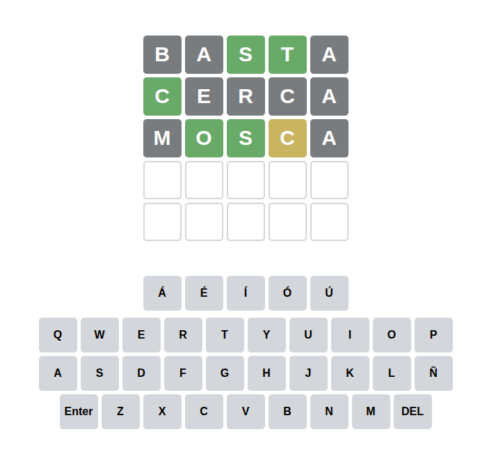
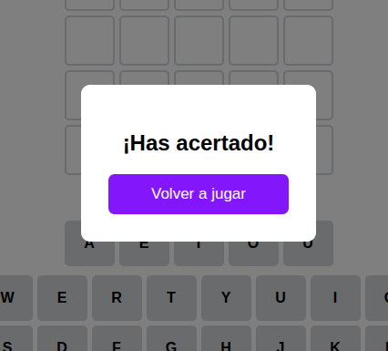

# Wordle Jolasa (W.I.P)
  
### Jokoa Wordle klon estilokoa.

## Deskribapena

Proiektu honek Wordle jokoaren antzeko sistema bat garatzen du.

## Nola Jolas dezakezu?

Lehenengo orrian, bi aukera ikus ditzakegu: bata hitza asmatzeko izango dugun saiakera kopurua aukeratzeko, eta bestea hitzak izango duen letra kopurua zehazteko. Biak aukeratu ondoren, jokoa hasten da.

  

Jokatzen hastean, ikus dezakegu jarri dugun saiakera eta letra kopurua pantaila honetan agertzen denarekin bat datorrela. Orain, hitza asmatzea besterik ez da geratzen. Saiakera bakoitzan hitza ausazkoa da. 

Funtzionamendua honako hau da:

- **Letra berdez**: Letra zuzena da eta posizio zuzenean dago.
- **Letra horiz**: Letra zuzena da, baina posizio okerrean dago.
- **Letra grisez**: Letra ez dago hitzean.

  

Froga honen kasuan, hitza "BANDA" zen, hitza asmatzean honela ikusten da.

  

